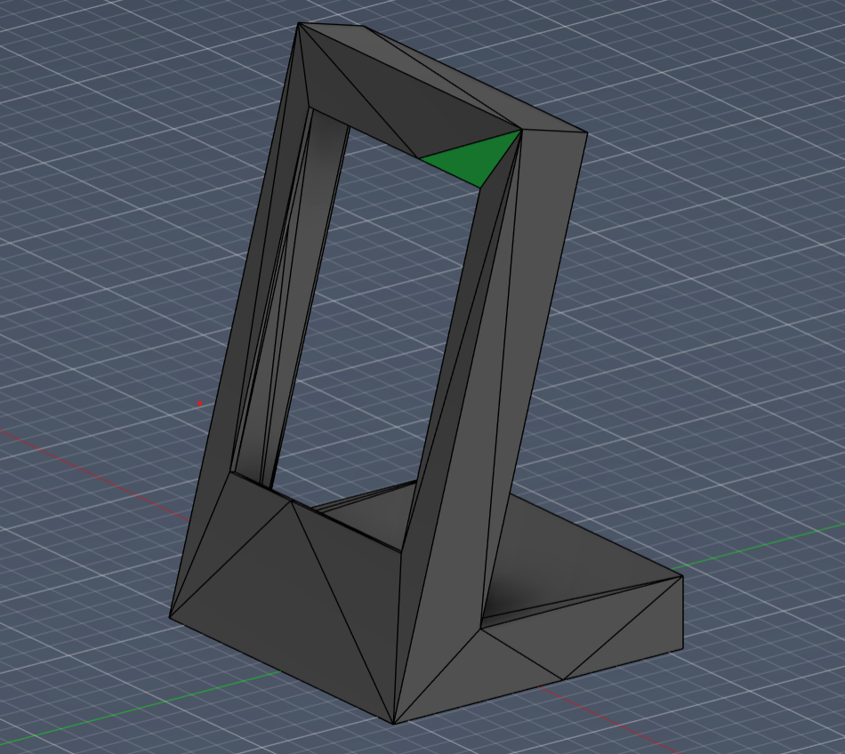
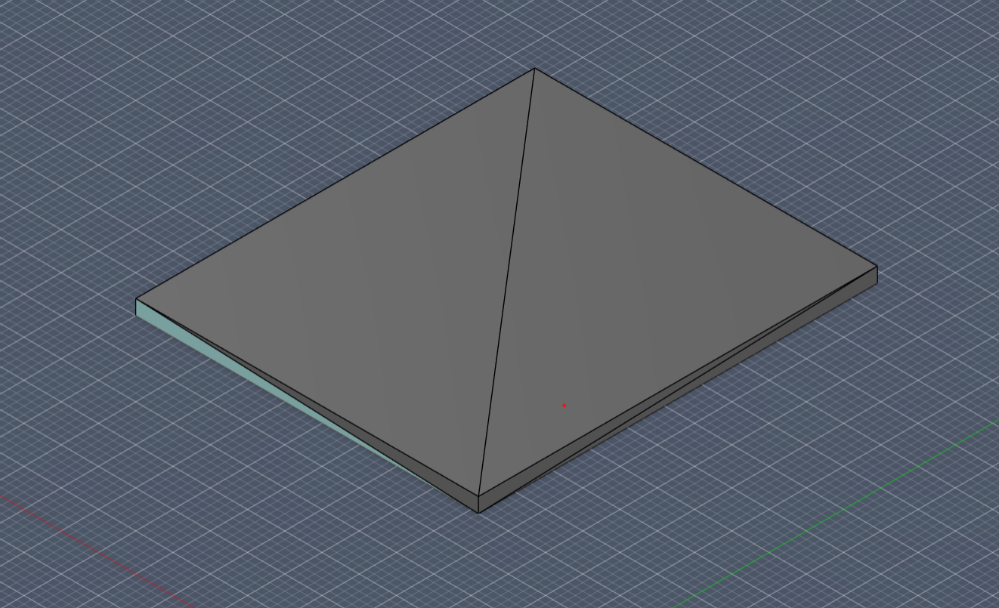
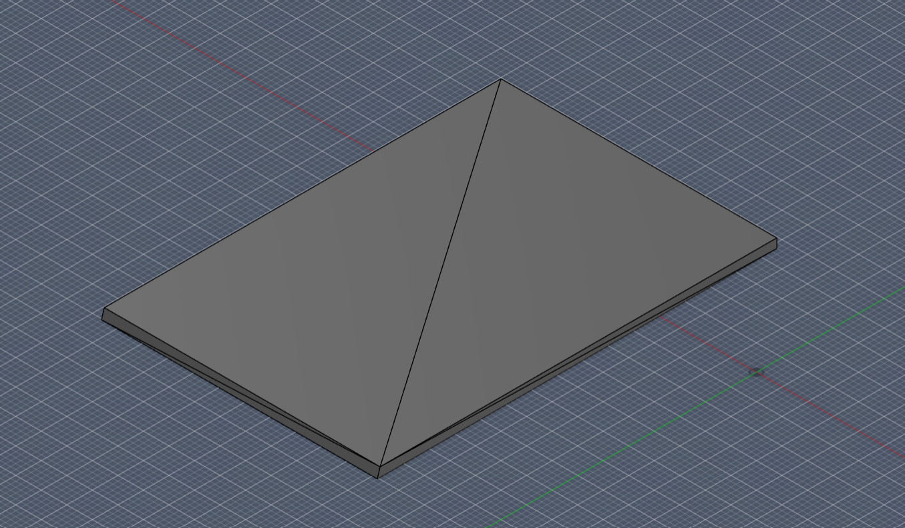
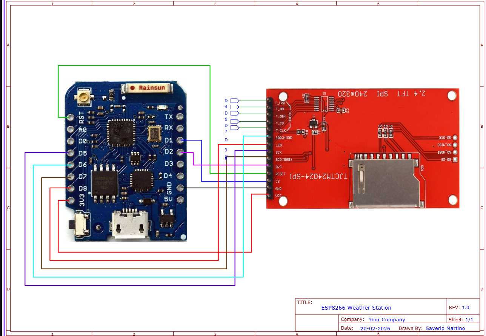

# ESP8266 Weather Station

This project creates a small desktop weather display based on the **ESP8266** and a **2.8" TFT display**.

It was born as an adaptation of the original ThingPulse project, with some hardware and mechanical simplifications.

The idea was to have a compact, attractive weather widget that would always be on the desktop, with data updated via WiFi.

---

## Functions

- Automatically updated time and date  
- Temperature, humidity, and pressure  
- Weather forecast up to 7 days  
- Wireless connection  
- Touchscreen navigation  

---

## BOM

| Component | Quantity | Link |
|-----------|---------|------|
| Wemos D1 Mini Pro (ESP8266) | 1 | [Amazon Link](https://amzn.eu/d/0iJDSxxK) |
| 2.8" ILI9341 TFT Display with touch screen | 1 | [Amazon Link](https://amzn.eu/d/05ybijSV) |
| Thin AWG 26 or 30 cables | several | [Amazon Link](https://a.co/d/0hL0mJ5J) |

---
## CAD

---

## PCB

No custom PCB was designed for this project.  
All components are connected using wires as shown in the wiring diagram above.

---
## Connections

### TFT → Wemos

 TFT -> Wemos 
 VIN -> 3.3V   
 GND -> GND    
 CS ->D1     
 RESET -> RST    
 DC -> D2     
 SDI -> D7     
 SCK -> D5     
 LED -> D8     
 SDO -> D6     

### Touch

 Touch Wemos 
 T_CLK -> D5     
 T_CS -> D3     
 T_DIN -> D7     
 T_DO -> D6     
 T_IRQ -> D4     

---

## Arduino IDE Setup

Install ESP8266 support by adding this URL to the **Board Manager**:

<https://arduino.esp8266.com/stable/package_esp8266com_index.json>

Select the board:

**LOLIN (WEMOS) D1 R2 & mini**

---

## How to Use

1. Open `weather_station.ino` in Arduino IDE.  
2. Insert your WiFi credentials and OpenWeatherMap API key in `settings.h`.  
3. Upload the firmware to the Wemos D1 Mini Pro.  
4. Once powered, the device will automatically connect to WiFi and display current weather, forecast, time, and date.  
5. Use the touchscreen to navigate between different weather screens.

---

## Why I Made This Project

I wanted a small, always-on weather display for my desk that is compact, visually appealing, and reliable.  
This project simplifies the original ThingPulse design while providing a fully custom enclosure and wiring layout.

---

### Recommended Settings

- CPU Frequency: **80 MHz**  
- Flash Size: **4MB (FS:3MB OTA:~512KB)**  

---

### Required Libraries

- Mini Grafx  
- ESP8266 WeatherStation  
- Json Streaming Parser  
- ThingPulse XPT2046 Touch  

> **Note:** If the standard **XPT2046_Touchscreen** library is installed, remove it before installing the ThingPulse library to avoid conflicts.

---

## OpenWeatherMap API

You need a free API key.

1. Register at: <https://openweathermap.org>  
2. Create an API key  
3. Insert it into the `settings.h` file along with your WiFi credentials  

---

## Final Notes

The project is very stable, but requires some patience to:

- solder the wires correctly  
- perform a proper touch calibration  
- arrange the cables neatly inside the case  

Once assembled, it works flawlessly and is perfect as a compact desktop weather widget.
